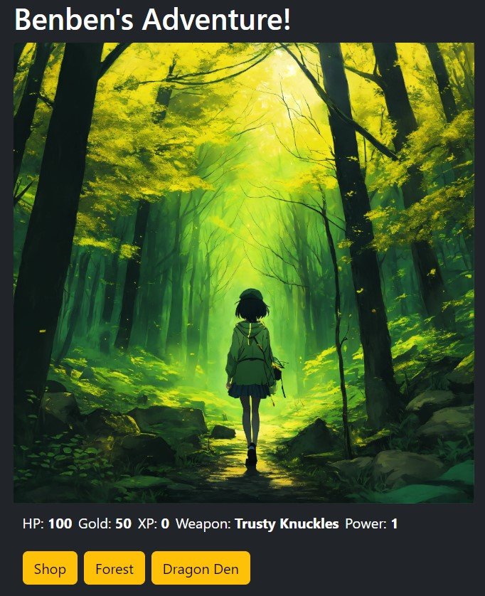

# Benben's Adventure

Welcome to Benben's Adventure. A text-based exploration game reminisce of role-playing games I grew up with. Click on the buttons to explore the locations. Fight monsters with tactics, and knowing when to retreat, is essential. Because living to fight another day is wisdom, not cowardice.

I have always enjoyed point and click elements, and the story in such games. Games such as Monkey Island with it's rich comedic dialoges, and Kingdom of Loathing's simple interface are what kept the imagination running as I read the stories and participated in the exploration aspect of the games. I wanted players to escape into this new world, enjoy the stories, and find ways to overcome the obstacles.

```
“It's not the destination, it's the journey” – Unknown.
```

# Getting started

After cloning the repo to your computer, simply open the folder, and look for the index.html file. Open the index.html in your browser, and you are good to go exploring!

# Attributions:

For designs, I have used bootstrap for the buttons, and the overall html styling. Bootstrap was also used for the popover found in JavaScript:-

- [Bootstrap](https://getbootstrap.com/)

Images are obtained from these sites:-

- [Lexica](https://lexica.art/)
- [TensorArt](https://tensor.art/)

Whenever I got stuck, or faced difficulties in implementing the codes or ideas, I would refer to the following for examples and write ups:-

- [W3Schools](https://www.w3schools.com/)
- [MDN](https://developer.mozilla.org/en-US/)
- [General Assembly Course Notes](https://generalassemb.ly/)

# Technologies Used

1. HTML
1. CSS
1. JavaScript
1. Visual Studio
1. Github
1. Chrome

# Next Steps

Next steps: Planned future enhancements (stretch goals).

- Add a companion. Chose from a variety of companions from ones who can damaged your enemy per round, to those that heal you
- Add audio playlist option
- Add more pathways
- Gameplay balancing
